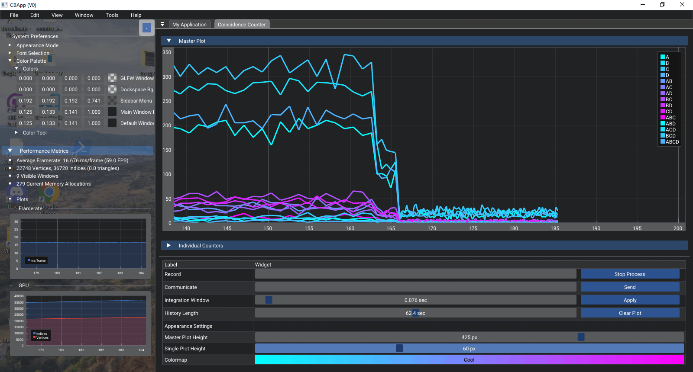
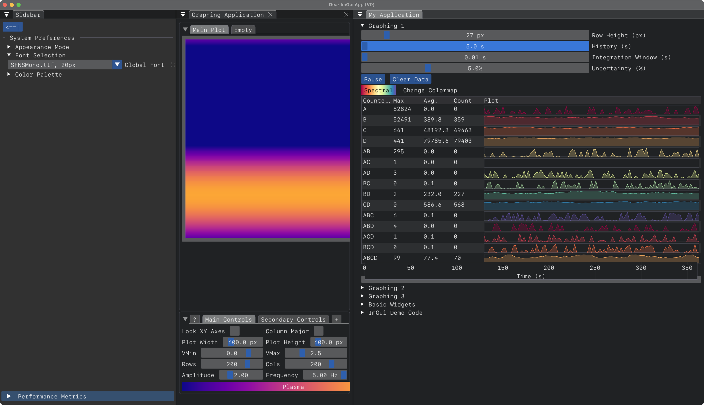
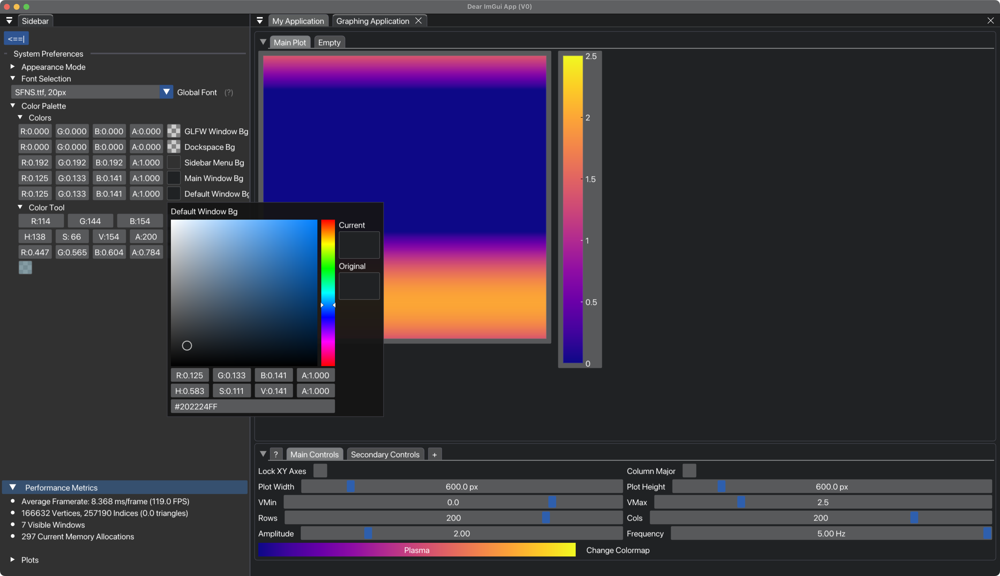

# *[**"\*CBApp"**]()* | *A cross-platform, GUI-based desktop application for computationally modeling electrodynamics with C++*


[](https://github.com/nlohmann/json/releases)


***Note:**  CBApp is just a generic, placeholder name I've given to this project for the purpose of having an identifier in the build system.*


---


[](https://github.com/collin-ballin/CBApp/commits/main)


---

---


- [1. SYNOPSIS](#SYNOPSIS)
- [2. PURPOSE & DESIGN](#purpose-and-objectives)
- [3. DESIGN](#design)
  - [User Interface](#user-interface)
    - [Overview](#overview)
  - [Theoretical Aims](#theoretical-aims)
  - [Implementation Aims](#implementation-aims)
- [4. FEATURES](#features)
  - [The `Editor` Application](#the-editor-application)
  - [The `Graph` Application](#the-graph-application)
  - [The `CCounter` Application](#the-ccounter-application)
  - [Additional Tools and Utilities](#additional-tools-and-utilities)
    - [Functional Testing Tool](#functional-testing-tool)
    - [Color Tool](#color-tool)
    - [ImGui Tools](#imgui-tools)
- [5. IMPLEMENTATION DETAILS](#implementation-details)
  - [Build System](#build-system)
    - [macOS (Xcode)](#mac-OS)
    - [Windows (VSCode)](#windows)
- [6. CURRENT STATUS](#current-status)
- [7. OTHER](#other)
  - [Legacy & Archive](#archive)
  - [License](#license)
  - [Author](#author)


## 1. SYNOPSIS

### [**This project seeks to develop a cross-platform, GUI-based desktop application for performing computational physics simulations.  Our project is built using modern C++ (cpp-20+), the *docking branch* of `Dear ImGui`, `OpenGL`, and `GLFW`.**]()


### Our application is built using `CMake`; `minGW` is used as a cross-platform toolchain to build the project for Windows.  The set of third-party dependencies is kept to a minimum to maximize the compatibility our application for use across a variety of different machines that may/may-not have access to certain installations.  Currently, these dependencies are limited to the `ImPlot` extension for Dear ImGui and `nlohmann`'s JSON for modern C++.


### The scope of this project is primarily focused on simulations of electrodynamic systems and specifically those using using the Finite-Difference Time-Domain method (FDTD). 


---
---

## 2. PURPOSE & OBJECTIVES

*Fundamentally, our application must facilitate each of the following tasks:*
- (1) Create and design an electrodynamic system along with the relevant parameters for each item within,
- (2) Perform a simulation of the conditions we specified within the system we created, 
- (3) Present a visualization of the simulation results and allow the user to interact with and analyze the data. 


---

---

## 3. DESIGN

*In this pursuit, our design has been structured in a manner as to adhere to the following goals:*


### ***USER INTERFACE.***
>
> Implementing a highly funcitonal user-interface is often an extremely time consuming and potentially frustrating task.  What's more---this is further pronounced when maintaining, refactoring, or extending an existing UI that is poorly thought-out.  At the penalty of increased complexity and initial development time, our goal has been to establish a robust and extensible UI that is accomodating to change, additions, or extensions.
>
>
>
>  #### UI Overview:
> >
> > *The overal layout of the UI design is inspired by the desigon of the Ableton Live application:*
> >   - **Menu Bar:**         The bar at the very top of the application containing the "File", "Window", "Help", etc, drop-down menus.
> >   - **Control Bar:**      The 'banner-style' panel that is found below the Menu Bar and spans the entire width of the main window. 
> >   - **Browser:**      The collapsible window pane found on the left hand side of the main window and spanning its entire height.
> >   - **Main Section:**     The primary window pane located beneath the Control Bar and to the right of the Browser. 
> >   - **Detail View:**      A second collapsible window pane located below the Main Section. 
> >
> >
> 
>
>
> > #### UI Features:
> >
> >  - Taking advantage of the `viewports` and `docking` features of Dear ImGui---the user is able to rearrange and customize the appearance and window layout of each part of the main application to suit their needs and preferences.  
> > 
> > 
> > - Each window of the application can be undocked and moved to a different docing location or even set aside to serve as an entirely seperate, stand-alone window. 
> >
> > 
> > - The colors, geometry, and fonts of the application can be customized, saved/loaded to an external file, overriden as the default settings of the app, and so forth.  
> >
> >
> >
> 
>
>
> #### Delegator Classes:
> > - Each major responsibility of the application is allocated to a `delegator` class in order to prevent the central `App` class from becoming bloated and cumbersome and, instead, delegating away certain responsibilities, as the name suggests.
> >
> > - This is a modular system that allows for additional windows, tools, and other features to be easily integrated into the core application services.
>
>


---

---

## 4. FEATURES


### ***THE `EDITOR` APPLICATION***
>
> Text
>
>  #### Sub-Item 1:
> > Some more text...


### ***THE `GRAPH` APPLICATION***
>
> Text
>
>  #### Sub-Item 1:
> > Some more text...


### ***THE `CCOUNTER` APPLICATION***
>
> Text
>
>  #### Sub-Item 1:
> > Some more text...


### ***ADDITIONAL TOOLS AND UTILITIES***
>
> A number of smaller utility tools have been created in order to solve certain problems that arose over the course of our development.  These tools remain accessible to the end user in the event that they should perhaps ever find them to be useful.  
>
>  #### Functional Testing Tool:
> > Some more text...
>
>
>
>  #### The Color Tool:
> > Some more text...
>
>
>
>  #### Dear ImGui Tools
> > Some more text...


---


This project wraps ImGui and OpenGL into a custom `App` class, bootstraps multi-window support via GLFW, and renders dynamically using a real-time frame loop.

The app layout, fonts, and color scheme are JSON-configured via files in `assets/`.


<p align="center">
  
  <br>
  <em>Figure 2. In development of a real-time 'Heat Map' plotting engine to serve as a core aspect of plotting data from FDTD simulations.</em>
</p>


<p align="center">
  
  
</p>

<em style="display:block; text-align:center;">
  <em>Figure 3. [Placeholder Images].</em>
</em>


---

---

## 5. IMPLEMENTATION DETAILS

>
> ### *3.1.  Build System (CMake)*
> > - Some information here.
> >
> > - Even more information over here.
> >
>
>
> 


>
> ### *5.2 macOS (Xcode)*
> > 
> > ```bash
> > #   OUT-OF-DATE   ---   I NEED TO UPDATE THIS INFORMATION (July 25, 2025)...
> > 
> > git clone https://github.com/your-username/CBApp.git
> > cd CBApp && mkdir build && cd build
> > cmake -G "Xcode" ..             # or use "Unix Makefiles"
> > cmake --build .
> > ./CBApp                         # launch the app
> > ```
>
>
>


>
> ### *5.3 Windows (Visual Studio)*
> > 
> > ```powershell
> > #   OUT-OF-DATE   ---   I NEED TO UPDATE THIS INFORMATION (July 25, 2025)...
> >
> > git clone https://github.com/your-username/CBApp.git
> > cd CBApp
> > cmake -G "Visual Studio 17 2022" .
> > cmake --build . --config Release
> > .\Release\CBApp.exe
> > ```
>
>
>


>
> ### *5.4 Project Directory Structure*
> > 
> > ```text
> > #   OUT-OF-DATE   ---   I NEED TO UPDATE THIS INFORMATION (July 25, 2025)...
> >
> > CBApp/
> >   ├── src/                      # *MY* Source Code...
> >   ├── include/                  # *MY* Header Files...
> >   ├── imgui/                    # Source Code for ImGui, ImPlot, and Backends...
> >   ├
> >   ├── assets/                   # User Data, ".ini" and ".json" for ImGui, TTF Font FIles, etc... 
> >   ├── libs/                     # Third-party libs (GLFW, JSON, cblib)
> >   ├── docs/                     # Markdown + change logs
> > ```


---
---

## 6. CURRENT STATUS

<p align="center">
  
  <br>
  <em>Figure 1. In development of a real-time 'Heat Map' plotting engine to serve as a core aspect of plotting data from FDTD simulations.</em>
</p>


---

---

## 7. OTHER


### Archive

[](https://github.com/nlohmann/json/releases)


### License

Distributed under the **MIT License**.
See `LICENSE.txt` for details.


### Author

> **Collin A. Bond**
>
> *Portland State University*


---
---

### MISC


and data analysis, and data visualization.  Our ultimate goal is for this application to serve in a similar capacity to the commercial products developed by companies such as Ansys Lumerical and others.


> ## This application is being designed with the intention to serve several purposes. 
> ## 1. First, this application will be used for real-time data analysis with a National Instruments FPGA-based coincidence counter that is used for the purpose of conducting experiments in quantum mechanics involving spontaneous parametric down-conversion via a BBO birifringent, isotropic crystal as well as single, individual photons and entanglement. 

The system is designed for data visualization and simulation—ideal for computational physics and real-time analysis tools.

> * Multi-viewport docking UI (Dear ImGui)
> * Real-time plotting (ImPlot)
> * Native performance (GLFW + OpenGL)
> * JSON-driven theming and font configuration
> * Modular C++ architecture with clean CMake/Xcode integration
