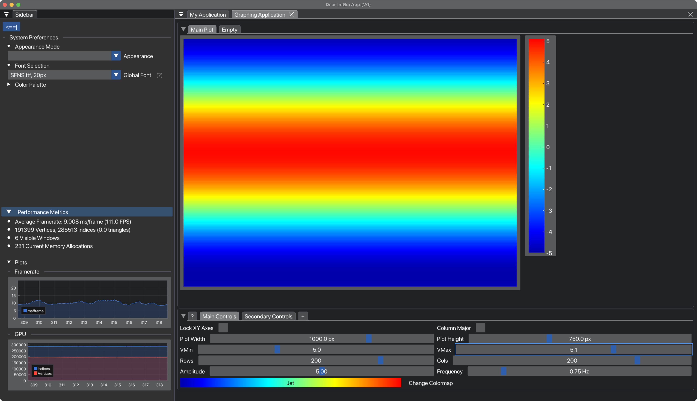

[](https://github.com/<owner>/<repo>/commits/main)


---

---


https://github.com/collin-ballin/imgui_V0.git


[](https://github.com/nlohmann/json/actions?query=workflow%3AWindows)


[](https://coveralls.io/github/nlohmann/json?branch=develop)
[](https://scan.coverity.com/projects/nlohmann-json)
[](https://app.codacy.com/gh/nlohmann/json/dashboard?utm_source=gh&utm_medium=referral&utm_content=&utm_campaign=Badge_grade)
[](https://cirrus-ci.com/github/nlohmann/json)
[](https://bugs.chromium.org/p/oss-fuzz/issues/list?sort=-opened&can=1&q=proj:json)
[](https://wandbox.org/permlink/1mp10JbaANo6FUc7)
[](https://json.nlohmann.me)
[](https://raw.githubusercontent.com/nlohmann/json/master/LICENSE.MIT)
[](https://github.com/nlohmann/json/releases)
[](https://repology.org/project/nlohmann-json/versions)
[](https://github.com/nlohmann/json/releases)
[](https://github.com/nlohmann/json/issues)
[](https://isitmaintained.com/project/nlohmann/json "Average time to resolve an issue")
[](https://bestpractices.coreinfrastructure.org/projects/289)
[](https://scorecard.dev/viewer/?uri=github.com/nlohmann/json)
[](https://github.com/sponsors/nlohmann)
[](https://api.reuse.software/info/github.com/nlohmann/json)
[](https://discord.gg/6mrGXKvX7y)

- [Design goals](#design-goals)
- [Sponsors](#sponsors)
- [Support](#support) ([documentation](https://json.nlohmann.me), [FAQ](https://json.nlohmann.me/home/faq/), [discussions](https://github.com/nlohmann/json/discussions), [API](https://json.nlohmann.me/api/basic_json/), [bug issues](https://github.com/nlohmann/json/issues))
- [Quick reference](#quick-reference)
- [Examples](#examples)
  - [Read JSON from a file](#read-json-from-a-file)
  - [Creating `json` objects from JSON literals](#creating-json-objects-from-json-literals)
  - [JSON as a first-class data type](#json-as-a-first-class-data-type)
  - [Serialization / Deserialization](#serialization--deserialization)
  - [STL-like access](#stl-like-access)
  - [Conversion from STL containers](#conversion-from-stl-containers)
  - [JSON Pointer and JSON Patch](#json-pointer-and-json-patch)
  - [JSON Merge Patch](#json-merge-patch)
  - [Implicit conversions](#implicit-conversions)
  - [Conversions to/from arbitrary types](#arbitrary-types-conversions)
  - [Specializing enum conversion](#specializing-enum-conversion)
  - [Binary formats (BSON, CBOR, MessagePack, UBJSON, and BJData)](#binary-formats-bson-cbor-messagepack-ubjson-and-bjdata)
- [Customers](#customers)
- [Supported compilers](#supported-compilers)
- [Integration](#integration)
  - [CMake](#cmake)
  - [Package Managers](#package-managers)
  - [Pkg-config](#pkg-config)
- [License](#license)
- [Contact](#contact)
- [Thanks](#thanks)
- [Used third-party tools](#used-third-party-tools)
- [Notes](#notes)
- [Execute unit tests](#execute-unit-tests)

## Design goals


# *"\*CBApp" – A cross-platform desktop application for computationally modeling electrodynamics A cross-platform, high-performance, GUI-based Desktop Applications with C++*


---

***Note:**  CBApp is just a generic, placeholder name I've given to this project for the purpose of having an identifier for the build system.*


### The crux of this project is to develop a cross-platform, GUI-based desktop application to serve as a tool for computational electrodynamic modeling and simulation using modern `C++`, the *docking branch* of `Dear ImGui`, `GLFW`, and `OpenGL`.  Complicit in this aim is the need to produce animated and interactive plots, graphs, and other data visualizations to convey the results of each simulation. 


<p align="center">
  
  <br>
  <em>Figure 1. In development of a real-time 'Heat Map' plotting engine to serve as a core aspect of plotting data from FDTD simulations.</em>
</p>


*In this pursuit, the following items are of particular importance for this design:*
>
> ### *THEORETICAL AIMS*
> > - Efficient implementation of the Finite-Difference Time-Domain (FDTD) method to conduct simulations 
>
>
>
>
> ### *IMPLEMENTATION AIMS*
> > - Developing a robust and versitile tool to accompany those working in areas related to electrodyanmics.
> >
> > - Modular framework that can be easily reorganized to facilitate different simulation tasks.
> >
> > - Careful consideration into numerical error and particularly that of finite-precision floating point truncation error.
> >
> > - Maintaining a high standard of runtime performance by optimizing algorithm design and implementing > efficient numerical methods and tecnhiques. 
> >
> >
> 


---

## 1. OVERVIEW

This project wraps ImGui and OpenGL into a custom `App` class, bootstraps multi-window support via GLFW, and renders dynamically using a real-time frame loop.

The app layout, fonts, and color scheme are JSON-configured via files in `assets/`.


<p align="center">
  
  <br>
  <em>Figure 2. In development of a real-time 'Heat Map' plotting engine to serve as a core aspect of plotting data from FDTD simulations.</em>
</p>


<p align="center">
  
  
</p>

<em style="display:block; text-align:center;">
  <em>Figure 3. [Placeholder Images].</em>
</em>


---

## 2. BUILD INSTRUCTIONS

### 2.1 macOS / Linux

```bash
git clone https://github.com/your-username/CBApp.git
cd CBApp && mkdir build && cd build
cmake -G "Xcode" ..             # or use "Unix Makefiles"
cmake --build .
./CBApp                         # launch the app
```


### 2.2 Windows (Visual Studio)

```powershell
git clone https://github.com/your-username/CBApp.git
cd CBApp
cmake -G "Visual Studio 17 2022" .
cmake --build . --config Release
.\Release\CBApp.exe
```


---

## 3. STRUCTURE

```text
CBApp/
├── CMakeLists.txt           # CMake entry
├── src/                     # App core & render loop
├── include/                 # Public headers (app/, utility/)
├── imgui/                   # ImGui + ImPlot + backends
├── assets/                  # JSON config, TTF fonts
├── libs/                    # Third-party libs (GLFW, JSON, cblib)
├── docs/                    # Markdown + change logs
```


---

## 4. LICENSE

Distributed under the **MIT License**.
See `LICENSE.txt` for details.


---

## 5. AUTHOR

> **Collin A. Bond**
>
> *Portland State University*


---
---

## OTHER


and data analysis, and data visualization.  Our ultimate goal is for this application to serve in a similar capacity to the commercial products developed by companies such as Ansys Lumerical and others.


> ## This application is being designed with the intention to serve several purposes. 
> ## 1. First, this application will be used for real-time data analysis with a National Instruments FPGA-based coincidence counter that is used for the purpose of conducting experiments in quantum mechanics involving spontaneous parametric down-conversion via a BBO birifringent, isotropic crystal as well as single, individual photons and entanglement. 

The system is designed for data visualization and simulation—ideal for computational physics and real-time analysis tools.

> * Multi-viewport docking UI (Dear ImGui)
> * Real-time plotting (ImPlot)
> * Native performance (GLFW + OpenGL)
> * JSON-driven theming and font configuration
> * Modular C++ architecture with clean CMake/Xcode integration
