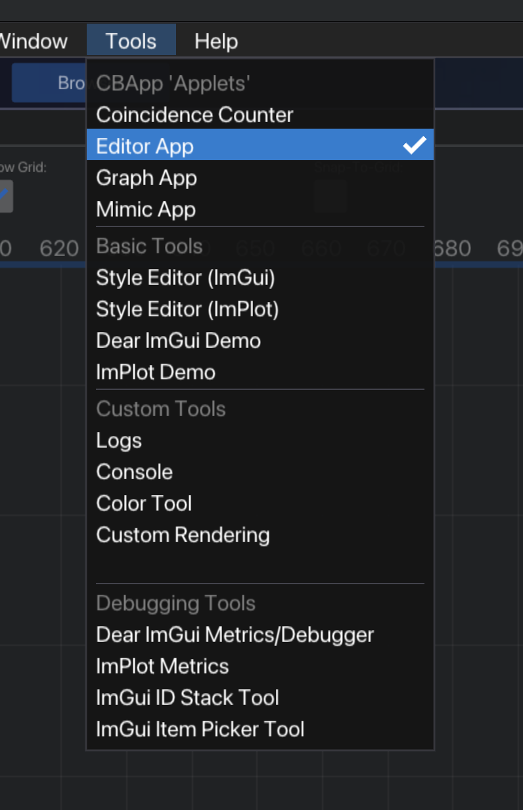
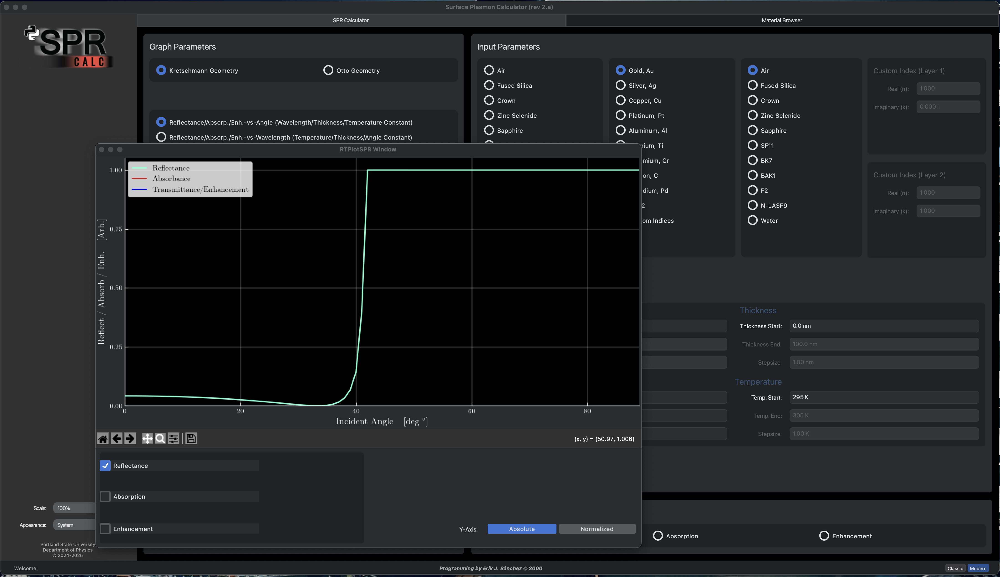

# *[**\*CBApp:**]()* *a cross-platform desktop application for computational electrodynamic modeling with C++*


<details open>
  <summary>Note:</summary>

  > *CBApp is just a generic, placeholder name I've given to this project for the purpose of having an identifier in the build system.*
</details>


[](https://github.com/collin-ballin/CBApp/releases)


---


[](https://github.com/collin-ballin/CBApp/commits/main)
\


\


\


\

\


---

---

## *`TABLE OF CONTENTS`*
<details open>
  <summary>TOC</summary>

  - [TABLE OF CONTENTS](#table-of-contents)
  - [1. SYNOPSIS](#1-synopsis)
  - [2. PURPOSE & DESIGN](#2-purpose--design)
  - [3. INTERFACE DESIGN](#3-interface-design)
    - [User Interface](#user-interface)
      - [Overview](#overview)
    - [Theoretical Aims](#theoretical-aims)
    - [Implementation Aims](#implementation-aims)
  - [4. APPLICATION FEATURES](#4-application-features)
    - [4A. MAIN APPLICATIONS](#4a-main-applications)
      - [4A.1 The `Editor` Application](#4a1-the-editor-application)
      - [4A.2 The `Mimic` Application](#4a2-the-mimic-application)
      - [4A.3 The `Graph` Application](#4a3-the-graph-application)
    - [4B. SECONDARY APPLICATIONS](#4b-secondary-application)
      - [4B.1 The `CCounter` Application](#4b1-the-ccounter-application)
      - [4B.2 `SPR Calculator` Application](#4b2-the-spr-calculator-application)
    - [4C. ADDITIONAL TOOLS AND UTILITIES](#4c-additional-tools-and-utilities)
      - [4C.1 Color Tool](#4c.1-color-tool)
      - [4C.2 ImGui Tools](#4c.2-imgui-tools)
  - [5. BUILD SYSTEM AND INSTALLATION](#5-build-system-and-installation)
    - [Build System (CMake)](#51-build-system-cmake)
    - [Project Setup](#52-project-setup)
    - [macOS (Xcode)](#53-macos-xcode)
    - [Windows (VSCode)](#54--windows-vscode--visual-studio)
  - [6. CURRENT PROJECT STATUS](#6-current-project-status)
  - [7. ADDITIONAL INFORMATION](#7-additional-information)
    - [Author](#author)
    - [Acknowledgements](#acknowledgements)
    - [License](#license)
    - [Legacy & Archive](#legacy--archive)

</details>
<!-- END "TABLE OF CONTENTS".-->


## *`1. SYNOPSIS`*
<details open>
  <summary>...</summary>

  ### [**This project seeks to develop a cross-platform, GUI-based desktop application for performing computational physics simulations.  Our project is built using modern C++ (cpp-20+), the *docking branch* of `Dear ImGui`, `OpenGL`, and `GLFW`.**]()


  <p align="center">
    
    <br>
    <em>Video 1. 1D FDTD Simulation; work was taken from an FDTD engine I developed for a recent paper and migrated into the CBApp interface.</em>
  </p>


  ### Our application is built using `CMake`; `minGW` is used as a cross-platform toolchain to build the project for Windows.  The set of third-party dependencies is kept to a minimum to maximize the compatibility our application for use across a variety of different machines that may/may-not have access to certain installations.  Currently, these dependencies are limited to the `ImPlot` extension for Dear ImGui and `nlohmann`'s JSON for modern C++.


  ### The scope of this project is primarily focused on simulations of electrodynamic systems and specifically those using using the Finite-Difference Time-Domain method (FDTD). 

</details>
<!-- END "1. SYNOPSIS".-->


---

---

## *`2. PURPOSE & OBJECTIVES`*
<details open>
  <summary>...</summary>

  *Fundamentally, our application must facilitate each of the following tasks:*
  - (1) Create and design an electrodynamic system along with the relevant parameters for each item within,
  - (2) Perform a simulation of the conditions we specified within the system we created, 
  - (3) Present a visualization of the simulation results and allow the user to interact with and analyze the data. 

</details>
<!-- END "3. INTERFACE DESIGN".-->


---

---

## *`3. INTERFACE DESIGN`*
<details>
  <summary>...</summary>


  ### ***USER INTERFACE.***
  >
  <details>
    <summary>More...</summary>
  
  *In this pursuit, our design has been structured in a manner as to adhere to the following goals:*

  > Implementing a highly funcitonal user-interface is often an extremely time consuming and potentially frustrating task.  What's more---this is further pronounced when maintaining, refactoring, or extending an existing UI that is poorly thought-out.  At the penalty of increased complexity and initial development time, our goal has been to establish a robust and extensible UI that is accomodating to change, additions, or extensions.
  >
  >
  >
  >  #### UI Overview:
  > >
  > > *The overal layout of the UI design is inspired by the desigon of the Ableton Live application:*
  > >   - **Menu Bar:**         The bar at the very top of the application containing the "File", "Window", "Help", etc, drop-down menus.
  > >   - **Control Bar:**      The 'banner-style' panel that is found below the Menu Bar and spans the entire width of the main window. 
  > >   - **Browser:**      The collapsible window pane found on the left hand side of the main window and spanning its entire height.
  > >   - **Main Section:**     The primary window pane located beneath the Control Bar and to the right of the Browser. 
  > >   - **Detail View:**      A second collapsible window pane located below the Main Section. 
  > >
  > >
  > 
  >
  >
  > > #### UI Features:
  > >
  > >  - Taking advantage of the `viewports` and `docking` features of Dear ImGui---the user is able to rearrange and customize the appearance and window layout of each part of the main application to suit their needs and preferences.  
  > > 
  > > 
  > > - Each window of the application can be undocked and moved to a different docing location or even set aside to serve as an entirely seperate, stand-alone window. 
  > >
  > > 
  > > - The colors, geometry, and fonts of the application can be customized, saved/loaded to an external file, overriden as the default settings of the app, and so forth.  
  > >
  > >
  > >
  > 
  >
  >
  > #### Delegator Classes:
  > > - Each major responsibility of the application is allocated to a `delegator` class in order to prevent the central `App` class from becoming bloated and cumbersome and, instead, delegating away certain responsibilities, as the name suggests.
  > >
  > > - This is a modular system that allows for additional windows, tools, and other features to be easily integrated into the core application services.
  </details>
</details>
<!-- END "3. INTERFACE DESIGN".-->


---

---

## *`4. APPLICATION FEATURES`*
<details open>
  <summary>...</summary>

  <p align="center">
    
    <br>
    <em>Figure 4-1. Menubar list displaying each tool that is available in the application.</em>
  </p>


## 4A. MAIN APPLICATIONS
<details open>
  <summary>...</summary>


### 4A.1. ***THE [EDITOR]() APPLICATION***
<details open>
  <summary>More...</summary>


  > The `Editor` Application is designed to be a CAD or Vector-Artwork style tool that will be used to create the system that will ultimately be simulated by the FDTD engine (see "`Graph` Application" below).
  >
  >  <p align="center">
  >            alt="editor-2.1"
  >        width="45%" />
  >            alt="editor-2.2"
  >        width="45%" />
  >  </p>
  >
  >  <em style="display:block; text-align:center;">
  >    <em>Figure 4A.1-2. Text...</em>
  >  </em>
  >
  >
  > 
  > 
  > 
  >  #### Object Creation:
  > > This tool provides a host of different tools to create objects and customize their geometry in a manner following that of a classic, solid-body modeling program.  This includes the ability to create exotic curvature in each object with a Bezier curve editing tool whose design was heavily inspired by that of the "Pen Tool" in Adobe Illustrator.  
  >
  >
  >
  >
  >
  >  #### Payloads:
  >
  >   <p align="center">
  >              alt="editor-2"
  >         width="95%" />
  >     <br>
  >     <em>Figure 4A.1-2. Using a right-click context menu to set the Payload of an object.</em>
  >   </p>

  > > Each object carries a `Payload`---which is used to carry the data that categorizes what the role of this object is within the FDTD simulation.  That is---by default, each object is simply an element of pure geometry that has no significance to the simulation on its own.  By assigning the `Payloads` for each object---we create the additional information that is needed to define each element of the system.  The host of different `Payloads` includes things like the following: 
  > > - `Sources:` 
  > >   - E or B sources such as Gaussian Pulse, Time-Harmonic, Ricker Wavelets, Monochromatic Plane Waves, and so forth, which are responsible for stimulating the field of the simulation.
  > >   - Each source may have a variety of additional properties depending on its particular type.  This includes, but is not limitied to, its frequency, the length of time it will be active for, its amplitude or intensity, whether or not it is a Hard or Soft source, descriptions of its dispersion or coherence properties, and so on.
  > > - `Materials:`  
  > >   - This describes the various media that are contained within the simulated domain, such as dielectrics, conductors, and so on. 
  > > - `Boundary Conditions:` 
  > >   - of the simulation (such as a Murr ABC, TF/SF, PML, etc)
  > > - `Monitors and Measurements:` 
  > >   - Monitors are used to indicate certain points or regions of interest within the simulation.  Placing a monitor at a certain region allows us to explicitly dictate what specific quantities of data we wish to record from the simulation.

</details><!-- END "4A.1. EDITOR APP".-->


### 4A.2. ***THE [MIMIC]() APPLICATION***
<details open>
  <summary>More...</summary>


  <p align="center">
    
    <br>
    <em>Figure 4A.1-1. Text...</em>
  </p>


  >
  > Text
  >
  >  #### Sub-Item 1:
  > > Some more text...

</details><!-- END "4A.2. MIMIV APP".-->


### 4A.3. ***THE [GRAPH]() APPLICATION (THIS WILL LATER BE RENAMED...)***
<details open>
  <summary>More...</summary>

  > This application is the actual FDTD Engine that will compute the simulation of the system that was designed with the `Editor` application.  Note that this name is just temporarly and will evelntually be replaced with a more-appropriate name once development proceeds further.  
  >
  >  #### Sub-Item 1:
  > > Some more text...

</details><!-- END "4A.3. GRAPH APP".-->


</details>
<!-- END "4A. MAIN APPLICATIONS".-->


## 4B. SECONDARY APPLICATIONS

###  4B.1. ***THE [CCOUNTER]() APPLICATION***
<details>
  <summary>More...</summary>


  <p align="center">
    
    <br>
    <em>Figure 4-1. Primary view of the Coincidence Counter plots as data is streamed from the Python script connected to the FPGA.</em>
  </p>


  > Designed to facilitate our work in the laboratory on Spontaneous Parametric Down-Conversion (SPDC) due to a pump laser that is incident upon a Birifringent, Anisotropic BBO crystal.
  >


  <p align="center">
    
    
  </p>

  <em style="display:block; text-align:center;">
    <em>Figure 4B.1-1. Display of the plots presenting the A, B, C, and D counter values for the APD detectors as well as each coincident permutation (e.g.: AB, AC, AD, ABC, etc...).</em>
  </em>


  >  #### The Coincidence Counter:
  > > The Coincidence Counter device in our lab is responsible for detecting and counting the number of single-photon arrivals which are produced by the SPDC process.  The way this is achieved is via a series of Avalanche Photodiode Detectors (APD) which are carefully placed at positions that coorespond to the trajectories of the phase-matching SPDC emission cones.  The output signal of each APD is monitored by a National Instruments Field Programmable Gate Array (FPGA) device.  The CCounter application runs a Python script inside a child process to interface with the FPGA using NI's Python API.  Hence---the ImGui application is responsible for fetching the data that is returned from the FPGA, displaying it in real-time, and allowing the user to perform data analysis and/or modifications to the FPGA.

</details><!-- END "4B.1. CCOUNTER".-->


###  4B.2. ***THE [SPR CALCULATOR]() APPLICATION***
<details>
  <summary>More...</summary>
  


  <p align="center">
    
    <br>
    <em>Figure 4B.2-1. Text...</em>
  </p>


  <p align="center">
    
    
  </p>

  <em style="display:block; text-align:center;">
    <em>Figure 4B.2-2. Text...</em>
  </em>


  > This was a project to re-create an application that my professor, Dr. Erik J. Sánchez, had designed in 2000 as a tool to accompany our experiments in the field of `plasmonics`.  The re-creation I made was done in `Python` using the `Tkinter` / `Custom Tkinter` packages to create the GUI.   
  >
  >  #### The Future of the `SPR Calculator` Project:
  > > As I have continued to learn more about `Dear ImGui`, it has become overwhelmingly clear to me that the best direction to proceed with the  SPR Calculator project is to create an additional `Applet` within `CBApp` and migrate this project into my existing ecosystem.  I learned a great deal about retained mode GUIs and a number of other topics from my work on this project in Python.  However---`Tkinter` packages and the nature of `Python` as a whole is *not* conducive for creating a robust tool that is able to withstand the test of time.  This, however, is not to say that such a result is impossible to achieve; but the 

</details><!-- END "4B.2. SPR CALCULATOR".-->


## 4C. ***ADDITIONAL [TOOLS]() AND UTILITIES***
<details>
  <summary>More...</summary>

  > *A number of smaller utility tools have been created in order to solve certain problems that have arisen over the development of this project.  These tools remain accessible to the end user in the event that they should perhaps ever find them to be useful.*


  ###  4C.1. ***THE [DEAR IMGUI TOOLS]()***
  >
  > > Each of the tools provided by the Dear ImGui demos can be accessed from the "Window > Show" menu in the Menu Bar.  This includes the Dear ImGui Demo and Style Editor, the ImPlot Demo and Style Editor, and etc.  Using these tools, the user can customize the appearance of the paplication to their requirements and subequently save these settings for future useage.  For DEBUG builds of the project, the ImGui Debugger tools will also be available under the same menu.


  ###  4C.2. ***THE [THE COLOR TOOL]()***
  >
  > > While constructing the UI of the project, a number of principles from color-theory were used to produce shades and color palettes which assist in communicating design intentions to the user as well as providing a visually appealing design for the application.  While creating these color schemes, a numner of tools were developed to compute the ideal shades and values programatically.  These tools remain available in the application for the user's convienence.


  ###  4C.3. ***THE [THE COLORMAP TOOL]()***
  >
  > > Similarly, a number of custom colormaps were generated to conform to specific needs of certain data visualization and analysis tasks. Additionally, the entire suite of colormaps that are available within the popular matplotlib package for Python have been extracted and included in CBApp as well. The tools for importing/exporting and creating custom colormaps have also been included within the application.

</details><!-- END "4C. ADDITIONAL TOOLS AND UTILITIES".-->


</details>
<!-- END "4. APPLICATION FEATURES".-->


---

---

## `5. BUILD SYSTEM AND INSTALLATION`
<details>
  <summary>...</summary>

  

  > ### *5.1. Build System (CMake)*
  > > - The project is built exclusively using `CMake` to ensure a that a widely available system with a great deal of support and resources is used.
  > >
  >


  > ### 5.2. Project Setup
  >
  > > - I have created a shell script to simplify the steps required to obtain the latest source code for the project, install each dependency that is needed to build and run the application, and produce a project file that can be immediately used to work with the application.  
  > > 
  > > - Currently, there is ONLY such a script that works for the macOS build of the project and generates an Xcode project file.  In the near future, I will develop an additional script to bootstrap development on a Windows machine and generate a VSCode / Visual Studio project file. 
  > >
  > >
  > > 
  > > #### *How to use the shell script:*
  > > - There are (ideally) *two* things that are required to get the project setup...
  > >
  > > - (1) Download the Xcode IDE from the AppStore.  Make sure to open the application once it is installed and allow it to install any additional tooling that it may request upon first running it. 
  > > - (2) Download [*this script (macOS)*](scripts/other/setup_cbapp.sh) from the repository.  You may need to give the script the appropriate RWE permissions before your machine will allow you to run it.
  > > - (3) You may also need to go into System Preferences and give Xcode and Terminal permission to access files on the Desktop if it is the first time your machine has done this kind of work. 
  > > - (4) Finally, we are ready to run the script and get the project setup: 
  > > ```bash
  > > sudo xcodebuild -license accept
  > > sudo xcodebuild -runFirstLaunch
  > > 
  > > xcode-select -p
  > > sudo xcode-select -s /Applications/Xcode.app/Contents/Developer
  > > 
  > > chmod u+x setup_cbapp.sh
  > > ./setup_cbapp.command
  > > ```
  > >
  > > 
  > > 
  > >
  > > - The script is located inside the `CBApp/scripts/other/` there is a file `setup_cbapp.sh`.  This file is designed to be a single-click bootstrap for the program.  Currently, this ONLY works for the macOS build---but I will be creating an additional script for a Windows bootstrap.  
  > > 
  > > - In other words, this is all that is required to use this scriot:
  > >   - (1) download the Xcode IDE from the AppStore. 
  > >   - (2) download this file from the repository. 
  > >   - and run it on your local system---it will: 
  > >   - install each dependency needed to build the app (Homebrew, CMake, GLFW, etc), 
  > >   - check if any of these dependencies are out-of-date, 
  > >   - create a directory `CBApp/scripts/other/`
  >


  > ### 5.3.  macOS (Xcode)
<details>
  <summary>...</summary>
  > > 
  > > ```bash
  > > #   OUT-OF-DATE   ---   I NEED TO UPDATE THIS INFORMATION (July 25, 2025)...
  > > 
  > > git clone https://github.com/your-username/CBApp.git
  > > cd CBApp && mkdir build && cd build
  > > cmake -G "Xcode" ..             # or use "Unix Makefiles"
  > > cmake --build .
  > > ./CBApp                         # launch the app
  > > ```
  >
  >
  >
</details>


  > ### 5.4.  Windows (VSCode / Visual Studio)


  <!--
    > ### *5.3 Windows (Visual Studio)*
    > > 
    > > ```powershell
    > > #   OUT-OF-DATE   ---   I NEED TO UPDATE THIS INFORMATION (July 25, 2025)...
    > >
    > > git clone https://github.com/your-username/CBApp.git
    > > cd CBApp
    > > cmake -G "Visual Studio 17 2022" .
    > > cmake --build . --config Release
    > > .\Release\CBApp.exe
    > > ```
    >
    >
    >
  -->


  <!--
    > ### *5.4 Project Directory Structure*
    > > 
    > > ```text
    > > #   OUT-OF-DATE   ---   I NEED TO UPDATE THIS INFORMATION (July 25, 2025)...
    > >
    > > CBApp/
    > >   ├── src/                      # *MY* Source Code...
    > >   ├── include/                  # *MY* Header Files...
    > >   ├── imgui/                    # Source Code for ImGui, ImPlot, and Backends...
    > >   ├
    > >   ├── assets/                   # User Data, ".ini" and ".json" for ImGui, TTF Font FIles, etc... 
    > >   ├── libs/                     # Third-party libs (GLFW, JSON, cblib)
    > >   ├── docs/                     # Markdown + change logs
    > > ```
  -->


</details>
<!-- END "6. CURRENT PROJECT STATUS".-->


---

---

## *`6. CURRENT PROJECT STATUS`*
<details open>
  <summary>...</summary>

  <p align="center">
    
    <br>
    <em>SLIDESHOW 2.  Assorted images taken across various points within the project's development.</em>
  </p>

</details>
<!-- END "6. CURRENT PROJECT STATUS".-->


---

---

## *`7. ADDITIONAL INFORMATION`*
<details open>
  <summary>...</summary>


  ### Author
  > - **Collin A. Bond**
  >   - A Recent [*Conference Paper*](https://iopscience.iop.org/article/10.1088/1742-6596/3052/1/012002) on FDTD.
  >   - Student of Physics and Computer Science.
  >   - *Portland State University*.


  ### License
  Distributed under the **MIT License**.  See `LICENSE.txt` for details.


  ### Acknowledgements
  > A special thanks goes out to the following individuals:
  >
  > - Dr. Erik J. Sánchez
  >   - Department of Physics, Portland State University.
  > - Dr. Andres H. La Rosa
  >   - Department of Physics, Portland State University.
  > - Prof. John B. Schneider
  >   - School of Electrical Engineering and Computer Science, Washington State University.
  >   - His *outstanding* book, [*Understanding the Finite-Difference Time-Domain Method*](https://eecs.wsu.edu/~schneidj/ufdtd/index.php).
  > - Dr. Jeroen Vleggaar
  >   - The [*Huygens Optics*](https://www.youtube.com/@HuygensOptics) YouTube Channel.


<!-- 

This project wraps ImGui and OpenGL into a custom `App` class, bootstraps multi-window support via GLFW, and renders dynamically using a real-time frame loop.

The app layout, fonts, and color scheme are JSON-configured via files in `assets/`.

-->


</details>
<!-- END "7. ADDITIONAL INFORMATION".-->


<!-- 


---

This project wraps ImGui and OpenGL into a custom `App` class, bootstraps multi-window support via GLFW, and renders dynamically using a real-time frame loop.

The app layout, fonts, and color scheme are JSON-configured via files in `assets/`.


---

---


## *`MARKDOWN TESTING`*
<details open>
  <summary>...</summary>


### STATUS:


<details>
  <summary>TO-DO:</summary>

  - [x] Implement SourcePayload
  - [ ] Correct issue with ImGui "<kbd>Clipper</kbd>":
    - When the search-query excludes all objects, the program crashes. 
  - [ ] New Path Z-Order:
    - When new paths are added, they default to the LOWEST Z-Order.  We want the opposite behavior to occur. 
  - [ ] Block the <kbd>Space</kbd> key: 
    - While editing a widget's text, the Editor should BLOCK the user from using <kbd>Space</kbd> to PAN the Editor canvas. 
  - [ ] The `Add Vertex Tool` does NOT Snap-To-Grid.
  - [ ] `Copy-And-Paste` does NOT copy each PATH-NAME.


</details>


-->


<!-- 

  <details>
    <summary>SAVED:</summary>


  <mark>critical</mark>


  


  


  


  


  Press <kbd>Ctrl</kbd>+<kbd>A</kbd> • Mode: <kbd>EDITOR</kbd>


  - [ ] Add TF/SF boundary
  - [x] Implement SourcePayload


  > [!NOTE]
  > This is a callout.
  > 
  > [!WARNING]
  > Handle PML carefully.

  </details>


-->


<!-- END "3. INTERFACE DESIGN".


  ---
  ---

  ### MISC
  and data analysis, and data visualization.  Our ultimate goal is for this application to serve in a similar capacity to the commercial products developed by companies such as Ansys Lumerical and others.


  > ## This application is being designed with the intention to serve several purposes. 
  > ## 1. First, this application will be used for real-time data analysis with a National Instruments FPGA-based coincidence counter that is used for the purpose of conducting experiments in quantum mechanics involving spontaneous parametric down-conversion via a BBO birifringent, isotropic crystal as well as single, individual photons and entanglement. 

  The system is designed for data visualization and simulation—ideal for computational physics and real-time analysis tools.

  > * Multi-viewport docking UI (Dear ImGui)
  > * Real-time plotting (ImPlot)
  > * Native performance (GLFW + OpenGL)
  > * JSON-driven theming and font configuration
  > * Modular C++ architecture with clean CMake/Xcode integration
  
-->
